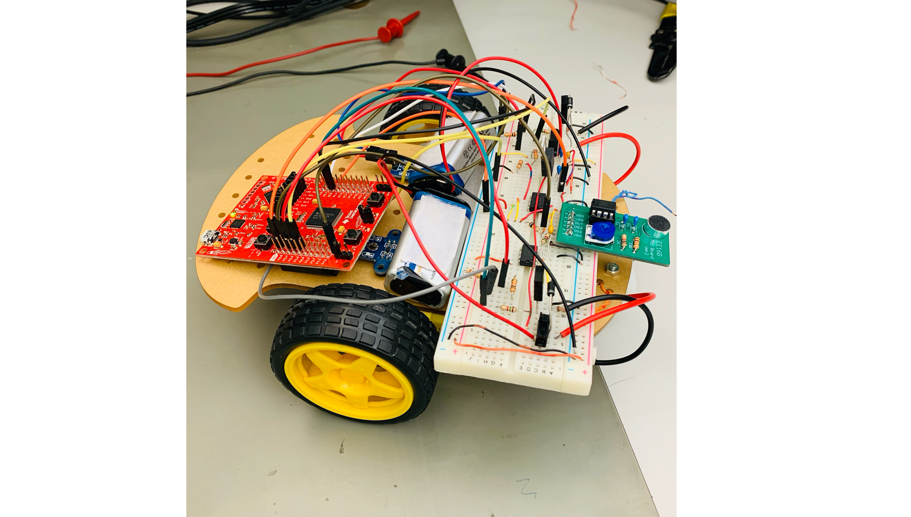
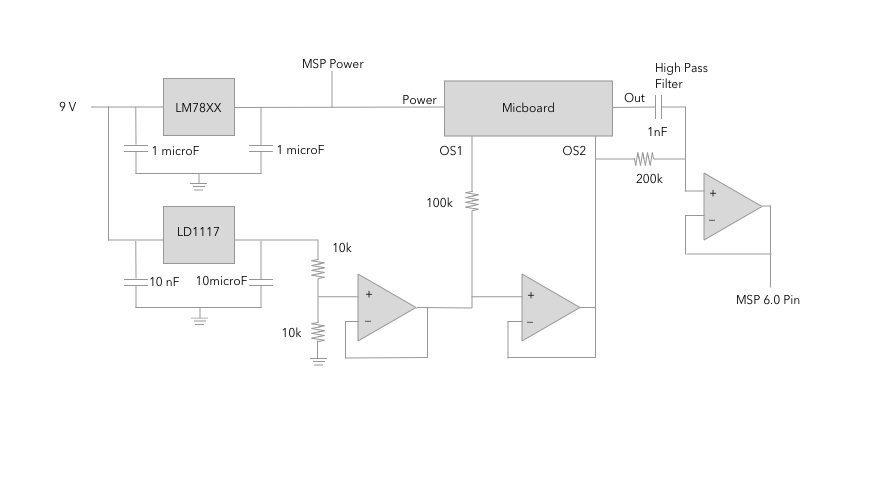
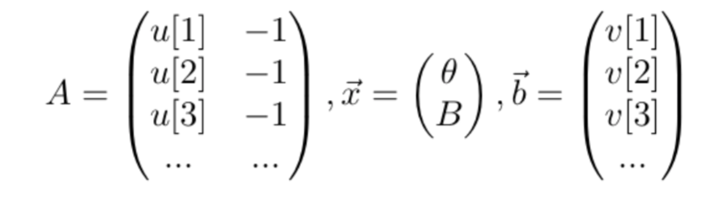

# Fabricating a Voice Controlled Robot Car

## About This Project
In this project, we  built a three-wheeled robot that is responsive to various voice command, as the final project of Electrical Engineering 16B at UC Berkeley. We built the circuit that received the audio signals and programmed the microcontroller to process the signals with PCA. With the closed-loop control feedback scheme, the robot can move according to a specific word we said.

## Front End Circuit
Before the project started, we learned the skill of circuit debugging and have built the filters and the microphone circuit that was used in the project. We first connect the microphone circuit to the breadboard. Then we built a voltage regulator on the breadboard and tested its output by multimeter to ensure it is 5V. We also implemented the microphone braising circuit with resistors and op-amps. Next, we calculate the resistors and capacitors to make the high pass frequency fall in the required range (250 Hz to 2500 Hz) and built the band pass filter, using the following formula:
f=1/(2πRC)
The values we chose are R = 200kΩ, C = 0.001μF, and f = 796.2 Hz.
We used oscilloscope to tune the microphone’s gain and built up the skeleton of the car and connect the motor drivers to the breadboard with the encoders.

## Schematic

## System Identification
We modeled the open loop system as following:
d[t+1] - d[t] = Θu[t] + B.
Here, d denotes the position of the car at time step t, u denotes the PWM inputs we controlled. The variables we wanted to find were Θ and B.
We collected the data points by inputting different PWM.
We also definde v[t] = d[t+1] - d[t]. The system of linear equations can be formed as below:

Then, we used least squares to solve for vector x.

